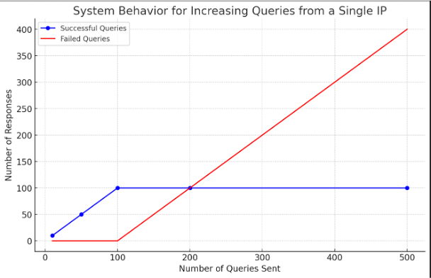
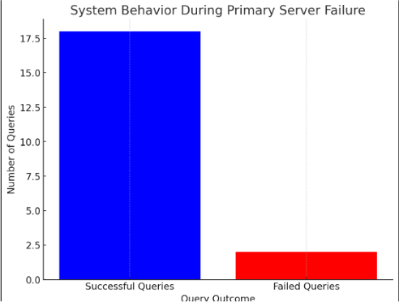
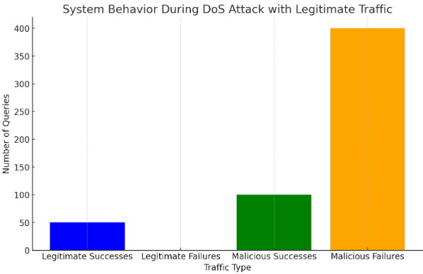

# DoS-Secure-DNS-Server
The project focuses on exploring data replication among multiple DNS servers to boost resilience against localized denial of service (DoS) attacks. The primary objective is to evaluate how data replication within DNS infrastructure can mitigate DoS threats by avoiding single points of failure, thus improving overall service resilience.

## Architecture

## Getting Started

### Step 1: Run the Primary DNS Server
To start the primary DNS server, execute the following command:

```bash
python main.py --port 31111 --zone_file zones/primary.zone --private_key_path keys/primary.pem --mode udp 
```

### Step 2: Run the Secondary DNS Server
Open a separate command prompt and start the secondary DNS server with
```bash
python main.py --port 31112 --zone_file zones/secondary.zone --private_key_path keys/secondary.pem --mode udp
```

### Step 3: Start the gatekeeper
To manage the primary and secondary DNS servers, open a separate command prompt and run:
```bash
python dns_gatekeeper.py --primary_ns_host=127.0.0.1 --primary_ns_port=31111 --secondary_ns_host=127.0.0.1 --secondary_ns_port=31112 --port=31110
```
The gatekeeper will now route traffic between the primary and secondary DNS servers.

### Step 4: Test the setup:
To verify the DNS setup, execute the test script:
```bash
python3 test.py
```

### Step 5: Start the DoS Attack
To initiate a DoS attack simulation, run the attack script with the following parameters:
```bash
python3 attack.py --host=127.0.0.1 --port=31110 --timeout=100 --num_threads=10
```

---

# Experimental Evaluation of Resilient DNS Server Framework

This section provides a detailed analysis of three experiments conducted to evaluate the performance and resilience of the proposed DNS server framework. Each experiment targets specific aspects of system behavior under various conditions, including rate-limiting, failover mechanisms, and resilience to DoS attacks.

---

## Experiment 1: System Under Multiple Queries from a Single IP

### **Objective**
To evaluate the Gatekeeper's rate-limiting capability in preventing a single IP address from overwhelming the system with excessive queries.

### **Setup**
- The Gatekeeper was configured with:
  - **Threshold:** 100 queries per IP within a 5-second window.
  - **Ban Duration:** 300 seconds for exceeding the threshold.
- Incremental batches of queries (10, 50, 100, 200, and 500) were sent from a single IP address.
- After each batch, the Gatekeeper's history log was reset to simulate independent sessions.
- Metrics tracked: number of successful and blocked queries, response times.

### **Findings**
- **Successful Queries Plateau:** Up to 100 queries were processed successfully, adhering to the configured threshold.
- **Failed Queries Increase:** Requests exceeding the threshold were consistently blocked, demonstrating effective enforcement.
- **No Performance Degradation:** The system handled all valid queries efficiently, maintaining stable response times.
- **Controlled Failures:** Blocked requests occurred only after surpassing the threshold, ensuring legitimate traffic was unaffected.

### **Result**
The Gatekeeper successfully enforced rate-limiting, effectively mitigating resource exhaustion from high query loads by a single IP.

**Graph Title:** System Behavior for Increasing Queries from a Single IP  


---

## Experiment 2: System Behavior During Primary Server Failure

### **Objective**
To assess the system's failover capabilities and ensure service continuity during a primary server outage.

### **Setup**
- Continuous DNS queries were sent for a 10-second duration.
- The primary DNS server was deliberately shut down after 2 seconds to simulate failure.
- Metrics tracked: successful queries before, during, and after failover; number of failed queries during transition; response times.

### **Findings**
- **High Query Success Rate:** Most queries were successfully resolved post-failover by the secondary server.
- **Minimal Transition Failures:** A small number of queries failed during the brief failover period due to detection and rerouting delays.
- **Seamless Traffic Handling:** The secondary server handled redirected traffic effectively, showcasing proper synchronization and load management.

### **Result**
The system demonstrated robust failover capabilities, ensuring high availability with minimal downtime during server outages.

**Graph Title:** System Behavior During Primary Server Failure  


---

## Experiment 3: System During a DoS Attack with One Valid IP

### **Objective**
To evaluate the system's resilience in prioritizing legitimate traffic amidst a simulated DoS attack.

### **Setup**
- 5 malicious IPs each sent 100 queries per second, simulating a DoS attack.
- 1 legitimate IP sent 5 queries per second.
- The attack duration was 10 seconds.
- Metrics tracked: number of successful and blocked queries (malicious vs. legitimate), response times for legitimate traffic.

### **Findings**
- **Legitimate Traffic Uninterrupted:** All queries from the legitimate IP were processed successfully, even during the attack.
- **Malicious Traffic Mitigation:** The first 100 queries from each malicious IP were processed, with subsequent requests blocked due to rate-limiting.
- **Rapid Detection:** The Gatekeeper promptly identified and blocked excessive traffic from malicious IPs, preserving system resources.

### **Result**
The system prioritized legitimate traffic, maintaining uninterrupted service while mitigating the impact of malicious activity.

**Graph Title:** System Behavior During DoS Attack with Legitimate Traffic  


---

## Conclusion

The results of these experiments validate the effectiveness of the proposed DNS framework in addressing key vulnerabilities. The Gatekeeper's rate-limiting mechanism efficiently handles high query volumes, the redundancy ensures seamless failover, and the system prioritizes legitimate traffic even under attack. These findings demonstrate the framework's resilience and suitability for deployment in real-world scenarios.